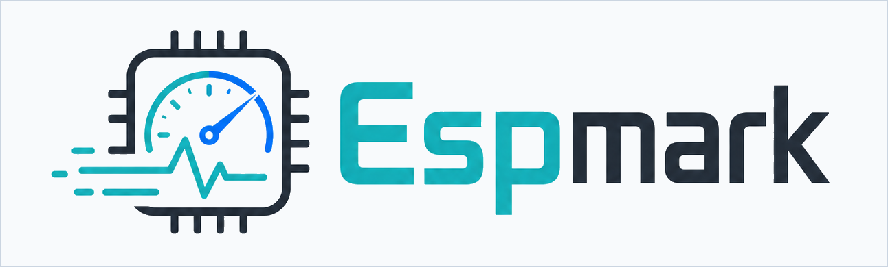

<p align="center">
  
</p>

# Espmark

Espmark is a browser-driven benchmark for ESP8266 and ESP32-family boards. It
runs deterministic firmware tests, computes an Espmark score, and can publish
results to the public leaderboard.

Official website:

```text
https://espmark.msmeteo.cz
```

The current public firmware release is `0.2.3`.

## Run The Benchmark

The easiest path is the web flasher:

1. Open `https://espmark.msmeteo.cz` in a browser with Web Serial support.
2. Connect an ESP8266 or ESP32-family board over USB.
3. Choose the matching generic firmware build and flash it from the page.
4. Reconnect the board if the browser asks for it.
5. Run the benchmark on the website.
6. Review the result and publish it to the leaderboard if you want it public.

## Arduino IDE

You can also build and upload the firmware yourself:

1. Open `arduino/espmark/espmark.ino` in Arduino IDE.
2. Install the required ESP8266 or ESP32 board package.
3. Select your board and serial port.
4. Compile and upload the sketch.
5. Open `https://espmark.msmeteo.cz` and run the benchmark through Web Serial.

For a serial-only run, open the serial monitor at `115200` baud and use the
commands printed by the firmware. Benchmark results are emitted between:

```text
ESPMARK_RESULT_BEGIN
ESPMARK_RESULT_END
```

## What Is Measured

Espmark focuses on deterministic core workloads so results can be compared
across boards and chip families:

- integer and sustained CPU work,
- fixed-point and float32 compute,
- RAM bandwidth and heap behavior,
- read-only flash throughput,
- CRC32, SHA-256, JSON, and string-formatting workloads.

Wi-Fi, Bluetooth, browser speed, USB bridge behavior, and other environment
dependent measurements are not part of the headline Espmark score.

## Repository Layout

```text
arduino/espmark/espmark.ino      benchmark firmware source
web/                             web UI and lightweight backend
web/firmware/manifest.json       web flasher manifest for official builds
web/scoring/                     versioned scoring registry
web/boards.json                  generated board catalog
tests/                           backend scoring tests
scripts/                         build and catalog helpers
```

## Manufacturer Names

Board and manufacturer names are used only to identify hardware and improve
result filtering. Espmark is an independent project and is not affiliated with,
endorsed by, sponsored by, or certified by any board or silicon manufacturer
unless explicitly stated.

## License And Brand

The firmware, benchmark code, scoring registry, tests, scripts, and
documentation in this repository are licensed under the Apache License 2.0
unless a file states otherwise.

The Espmark name, logo, visual identity, official website, leaderboard, result
database, and brand assets are not licensed under Apache 2.0. They may not be
used to imply affiliation, endorsement, sponsorship, certification, or
partnership without prior permission.

See `LICENSE`, `NOTICE`, and `TRADEMARKS.md` for details.
